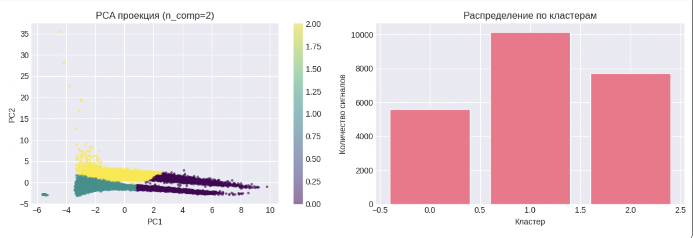

# Кластеризация сигналов сцинтилляционного детектора

## Описание проекта
В некоторых веществах в результате прохождения через них заряженных частиц возникают короткие вспышки света – сцинтилляции. Вещества, излучающие свет под действием ионизирующего излучения, называют сцинтилляторами.

Сцинтилляции отличны от остальных видов свечения, образующегося во время взаимодействия частиц с веществом тем, что они возникают вследствие электронных переходов внутри так называемых центров свечения. Такими центрами свечения могут служить, например, атомы, ионы, молекулы. Каждая вспышка вызвана отдельной заряженной частицей и состоит из большого количества (10^3 − 10^6) фотонов.

- При получении данных, был использован сцинтилляционный детектор, на основе органических кристаллов паратерфенила.
- Перспективность сцинтилляторов на основе органических кристаллов паратерфенила в регистрации нейтронного излучения в присутствии гамма-фона обуславливает большое содержание атомов водорода в вышеупомянутых элементах систем детектирования.
   > Для регистрации нейтронов используют эффект упругого рассеяния нейтронов с ядром.

### Задача -  разделить сигналы сцинтилляционного детектора на **три кластера**:
- Гамма-кванты
- Нейтроны
- Шум / артефакты (не поддающиеся кластеризации)

### Метрика: accuracy

### Stack: 
KMeans, AgglomerativeClustering, DBSCAN, PCA

### Источник данных: 
Лаборатория Национального исследовательского ядерного университета МИФИ.

## Описание данных
- `Run200_Wave_0_1.txt` — исходные сигналы (500 отсчётов на сигнал)
- Первые 4 колонки — метаданные (не используются)
- Размер выборки: 23 479 сигналов
- Сигнал перевернутый

## Алгоритм решения:
1. **Выделение сигнала** — вычитание нулевой линии (первые 50 отсчётов)
2. **Инверсия сигнала** — приведение к классическому виду (пик вверх)
3. **Извлечение признаков**:
   - **amplitude** - Амплитуда
   - **area** - Площадь под сигналом
   - **PSD** - Pulse Shape Discrimination
   - **decay_time** - Время затухания/высвечивания (экспоненциальная аппроксимация)
   - **Skewness** - асимметрия, как дополнительные признаки
   - **Kurtosis** - эксцесс, как дополнительные признаки
4. **Кластеризация** — KMeans + PCA

## Структура проекта
'''
├── solution.ipynb      # JN с полным решением
├── submission.csv      # Файл с результатами (индекс - кластер)
└── README.md           # Описание проекта
'''

## Результат
- **Оптимальные параметры**:
```
    'features': ['amplitude', 'area', 'PSD', 'decay_time', 'skewness', 'kurtosis', \
                 'log_amplitude', 'log_area', 'log_decay', 'area_per_amplitude'],
    'scaler': StandardScaler(),
    'n_components': 2,
    'short_gate': 10
    'KMeans': n_clusters=3, random_state=42, n_init=10
```
### Визуализация:


На графике видно три кластера:
- **Фиолетовый** — гамма-кванты
- **Зелёный** — нейтроны
- **Жёлтый** — шум/артефакты

### Качество кластеризации
- **Silhouette score**: 0.45
- **Submission score**: 0.567
- **Финальный сабмит**: `submission_10KM2.csv`

## Запуск
1. Открыть `solution.ipynb` в Jupyter Notebook / VS Code / Google Colab
2. Убедиться, что файл `Run200_Wave_0_1.txt` находится в той же папке
3. Выполнить все ячейки последовательно
4. Файл `submission.csv` будет создан автоматически


## Автор:
Мишра Алла


